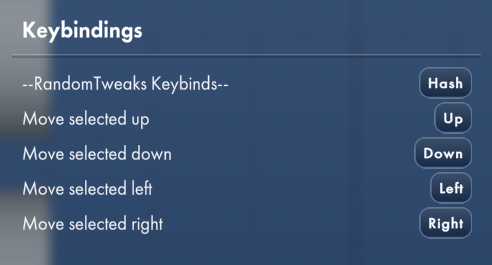

# RandomTweaks

Adds small QoL features. [Interesting introduction goes here].

Feel free to suggest new features.

## Current features

- Shrink the part selection outline as you zoom in
- Expand the limits for zooming

- Move selected parts with the arrow keys

- Remove the second popup when entering a world prompting you to clear the build area

