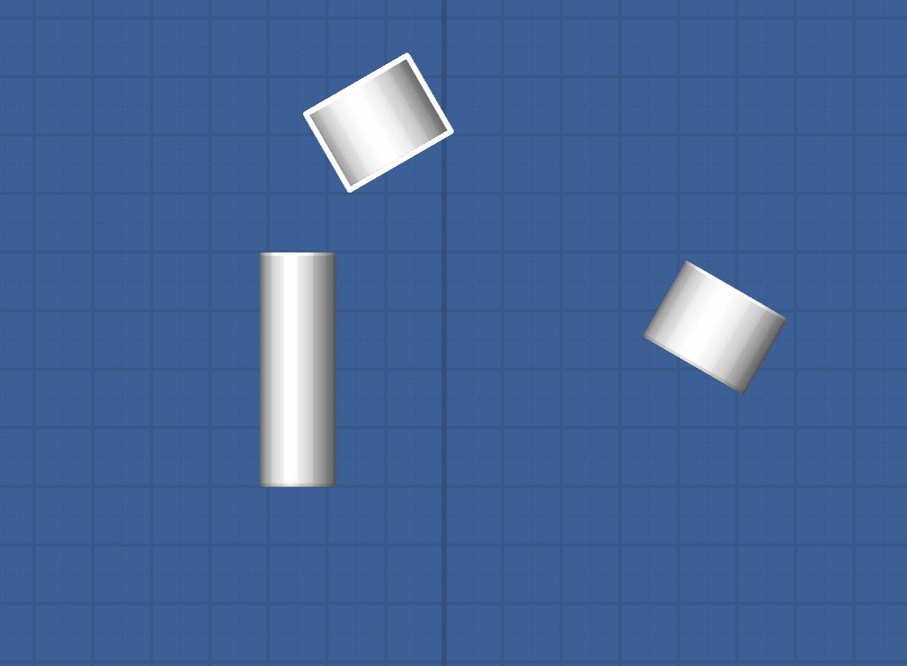
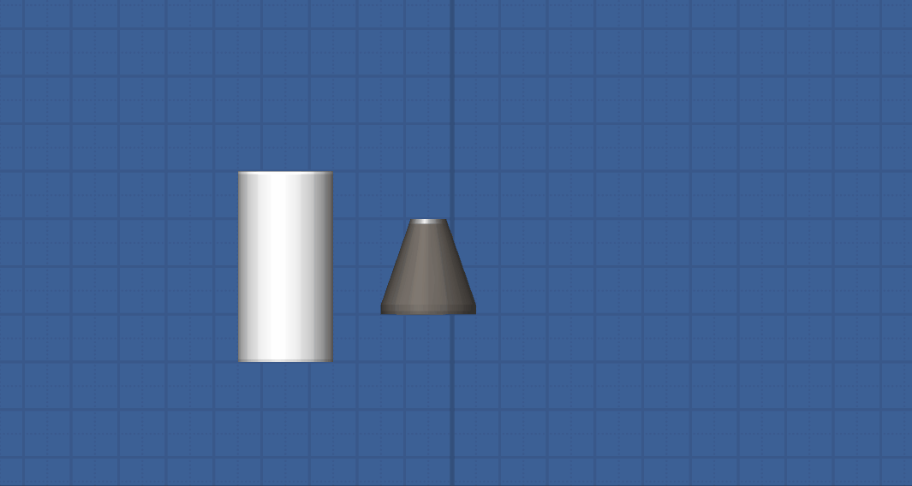

# RandomTweaks 🔧

RandomTweaks is a mod for the Steam version of Spaceflight Simulator which adds small quality of life features and intuitive basic built-in bp-editing functionality. Latest release runs on Version `1.1.2` of the [SFS Modloader](https://github.com/105-Code/SFS-Modloader/releases/tag/v1.1.2) by dani0105. 

Feel free to suggest new features.

## Current features 🚀

- Adds new shortcuts for modifying parts in-game:
  - Move selected parts around with: `↑`/`↓`/`←`/`→`
  - Resize parts with: `ctrl` + `↑`/`↓`/`←`/`→`
  - Get smaller increments of moving and rotating with: `shift` + `↑`/`↓`/`←`/`→`/`q`/`e`

  

- Enables the new experimental build mode as shown below. Press `n` to enable it. 

- Shrinks the part selection outline as you zoom in
- Increases the zoom limits

- Removes the redundant game popup when entering a world prompting you to clear the build area

## Installation Instructions 📂
1. Follow the instructions to add Version `1.1.2` of the [SFS Modloader](https://github.com/105-Code/SFS-Modloader/releases/tag/v1.1.2) by dani0105 to your Steam Installation. Instructions can be found here: [SFS Modloader Wiki](https://github.com/105-Code/SFS-Modloader/wiki)
2. Go to the Releases tab on the side and download the `RandomTweaks.ddl` from the latest release.
3. Go to the `Spaceflight Simulator_Data/MODS` folder and create a new folder inside called `RandomTweaks`.
4. Put the `RandomTweaks.ddl` file inside the `RandomTweaks` folder you created.
5. Run the game and check that it works!
